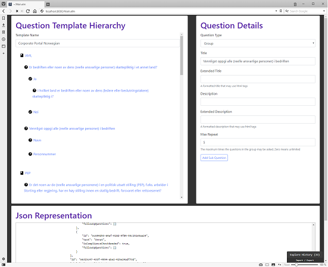

Background
==========
The compliance template editor is a web ui for editing question templates. A new question template can be created from scratch or an existing template can be modified. 

The current suggested workflow is to retrieve the json representation of the question template using the compliance api (swagger), copy the json into the edit box in the template editor, use the ui to edit and then copy the new json representation into swagger for a POST question template action.

The template editor is written in [elm](http://elm-lang.org/). 

Getting started
===============

1. Install elm
2. Clone the [template editor repo](https://bitbucket.org/collectorbank/collector-compliance-template-editor)
3. Run "elm reactor" in the root folder it will start a web server on http://localhost:8000.  
4. Surf to http://localhost:8000
5. Select Main.elm (first time will take quite some time to build since packages will be downloaded)

You may use any editor ofcourse but visual studio code works fine with the elm plugin. 

Build & Deployment
==================

[Team City](https://teamcity.collectordev.se/project.html?projectId=CommonServices_CollectorComplianceTemplateEditor&branch_CommonServices_CollectorComplianceTemplateEditor=__all_branches__)

[Octopus](https://octopus.collectordev.se/app#/projects/compliance-template-editor/overview)

An experimental bitbucket pipeline for build and deployment has also been setup. This is not the preferred way currently and has only been used to evaluate the bitbucket pipeline concept.

Development
===========
This [elm tutorial](https://www.elm-tutorial.org/en/) is quite good. It might be worth having a look at if you are not familiar with elm.

This project uses functional lenses or optics to modify the application state instead of having lots of different update messages. Using lenses in elm is a bit controversial but I found it rather convenient.

Tests
=====
To run the tests locally you need to install [elm-test](https://www.npmjs.com/package/elm-test).

Run "elm-test --fuzz 40" in the project root folder to execute the tests. Note that it takes a while (and the higher fuzz value the longer).